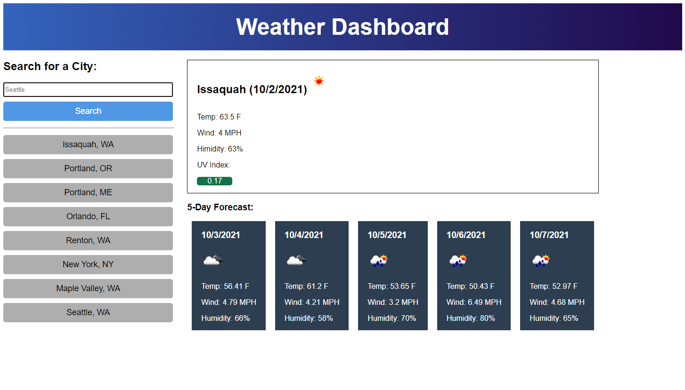

* A weather dashboard with form inputs
* When a city is searhed current and future data is show and that city is added to the history.
* Current conditions should include:
    * City name
    * The date
    * An icon for the weather conditions
    * The temp
    * The humidity
    * The wind speed
    * The UV index
        * This should change color depending on how high the number is.
* The five day forecast should inclue
    * The date
    * An icon for the weather conditions
    * The temp
    * The wind speed
    * The humidity
* When I click on the cities in the search history those cities should load.
    * up to 8 cities are stored in local storage
    * History wont store duplicate cities

https://lemelisk27.github.io/weather-dashboard/  
  
